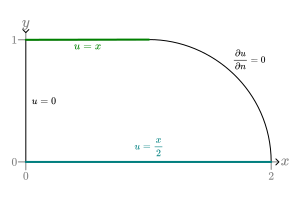
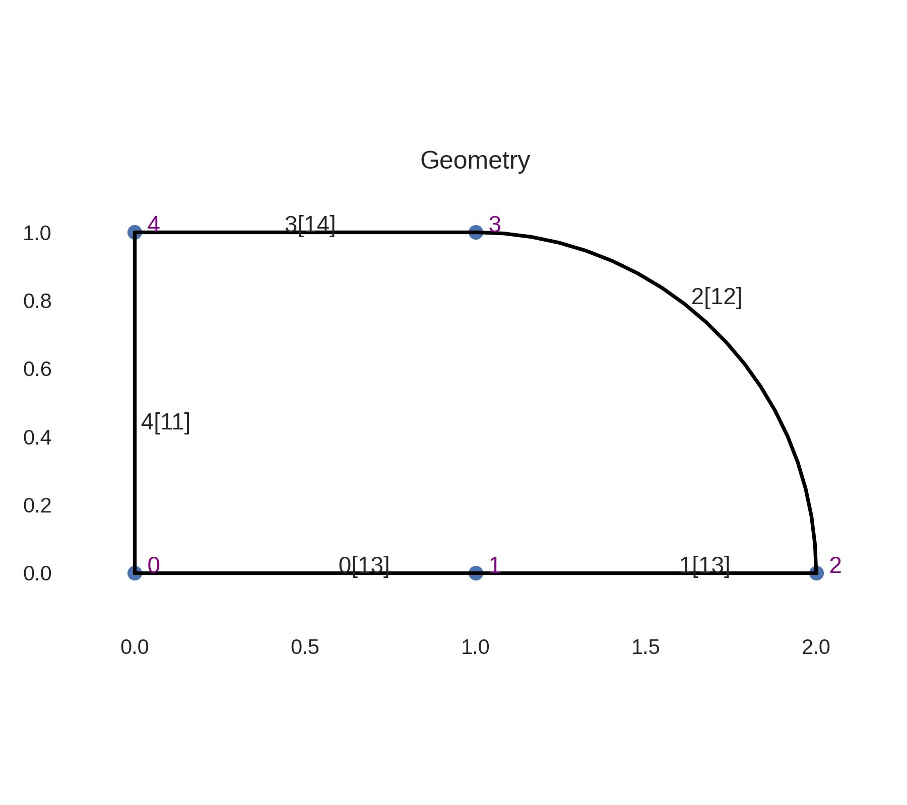
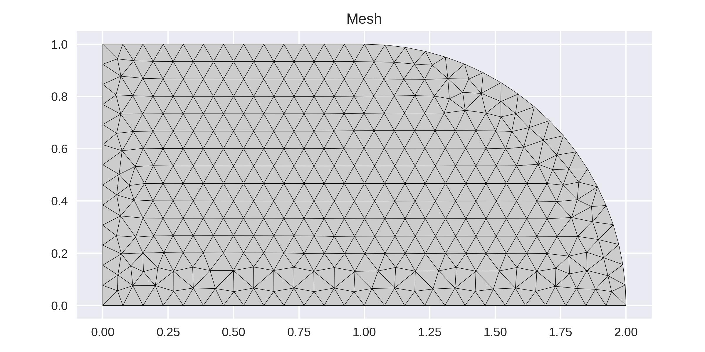
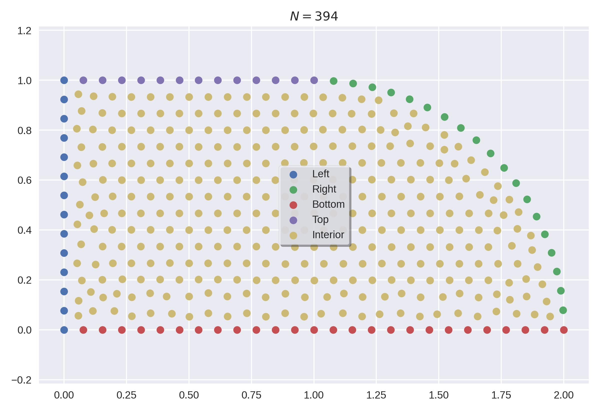
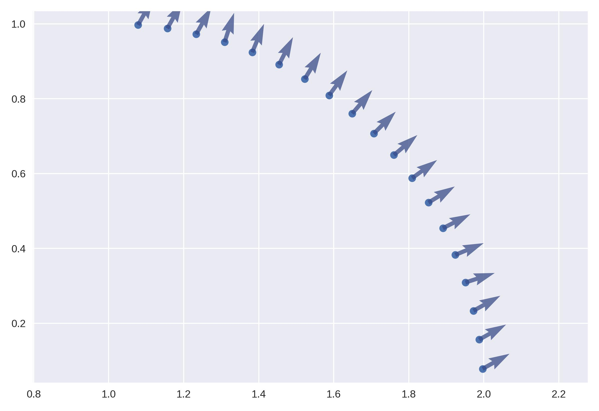
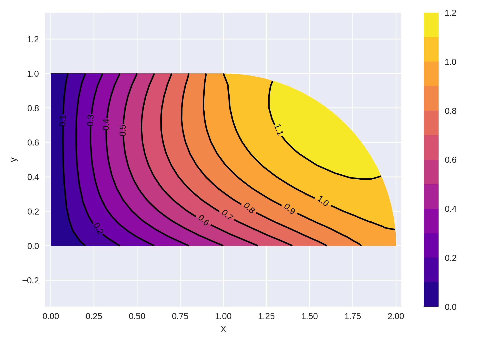
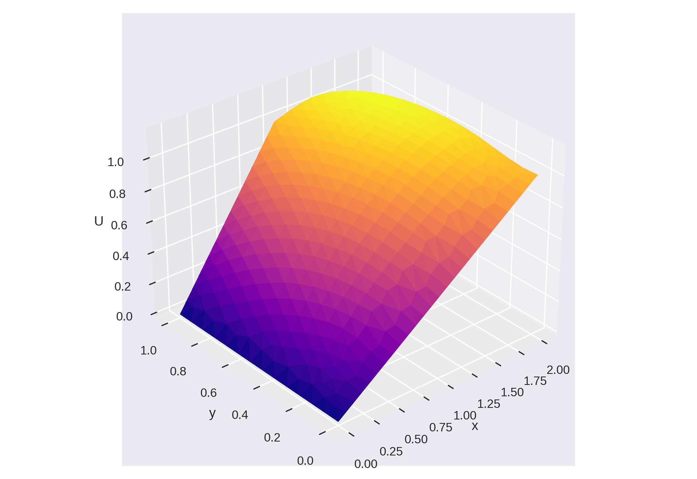

# Examples
To illustrate the capability of GFDMI in solving 2D differential equations, we provide the following examples.

# Example 00
For this first example, we solve the Poisson equation with a permeability coefficient $k=1$:

$$
\begin{aligned}
k \nabla^2 u = f \\
\nabla^2 u = f
\end{aligned}
$$

It was solved in a rectangular domain $\Omega = [0,2]\times[0,1]$, changing the right side for a quarter of a circle, as shown in figure:

The boundary conditions are expressed as:
$$
u|_{\text{left}} = 0 \\
u|_{\text{top}} = x \\
u|_{\text{bottom}} = \frac{x}{2} \\
\left.\frac{\partial u}{\partial n}\right|_{\text{right}} = 0
$$

The geometry created using `calfem-python` is

And the mesh generated also with `calfem-python` is

After identifying the boundaries, we plotted each one using different colors:

For Neumann boundary conditions, the normal vectors are computed. In this example, the only boundary of this type is the right boundary, for which the normal vectors are plotted:

After assembling the system $KU=F$ and solving it, we obtain $U$, which is plotted as both a contour plot and a 3D surface:

# Example 01
